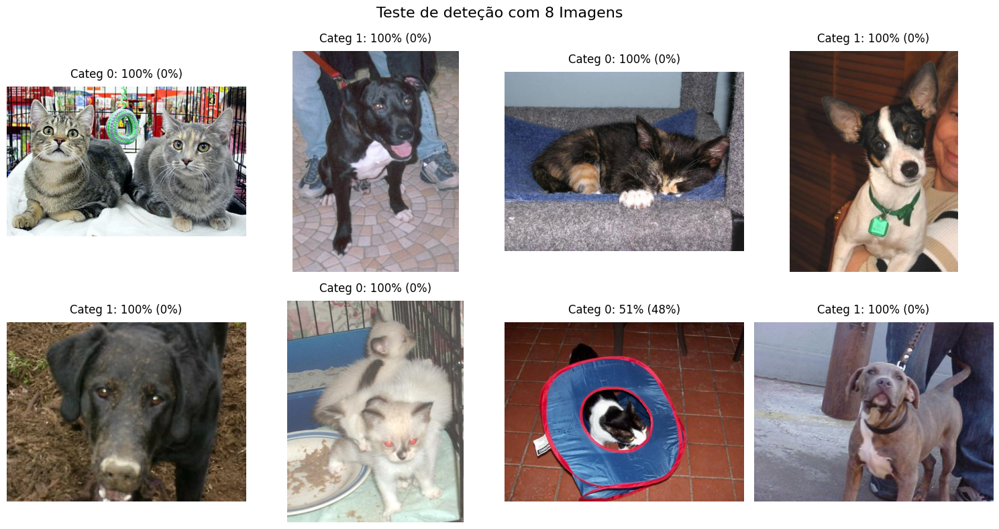

<h1> Transfer learning </h1>

  
  
  
  

Este Projeto foi realizado por Maurício André de Almeida como trabalho no curso de Treinamento de Redes Neurais com Transfer Learning na DIO.ME

<h2>Projeto de Transfer Learning em Python</h2>

O projeto consiste em aplicar o método de Transfer Learning em uma rede de Deep Learning na linguagem Python no ambiente COLAB.

Foi utilizado como exemplo o projeto: https://colab.research.google.com/github/kylemath/ml4a-guides/blob/master/notebooks/transfer-learning.ipynb 

O dataset utilizado engloba duas classes: gatos e cachorros (link: https://www.tensorflow.org/datasets/catalog/cats_vs_dogs). 
Para o download deve ser acessado pelo link: https://www.microsoft.com/en-us/download/details.aspx?id=54765.

Foi utilizado o modelo pré-treinado com o dataset Imagenet (https://www.image-net.org/) 
baixado em https://storage.googleapis.com/tensorflow/keras-applications/vgg16/vgg16_weights_tf_dim_ordering_tf_kernels.h5

Foi removida a última camada do modelo, reduzindo-o para apenas 2 categorias 

Realizado o re-treinamento com imagens de gatos e cachorros em 10 épocas 

Para finalizar, testamos o modelo com 8 imagens que não faziam parte dos datasets de treinamento, validação e testes.

📸<b>Tela de resultados:</b> 

❔ Instruções de uso:
 - Carregar o dataset manualmente no Collab na pasta Content
   - baixar localmente do site: https://www.microsoft.com/en-us/download/details.aspx?id=54765
   - descompactar localmente, compactar separadamente o aquivo Cat.zip e Dog.zip com o diretório correspondente.
   - Realizar o upload dos arquivos zip no Collab, utilizando o ícone da Pasta no lado esquerdo da tela
 - No menu RUNTIME escolher a opção RUNALL

✔️ Técnicas e tecnologias utilizadas

   - Python
   - Keras
   - Tensorflow
   - Google Colab
   - Datasets: Imagenet e cats&dogs

📁 Acesso ao projeto

   - Você pode baixar os arquivos do projeto clicando [aqui](https://github.com/mauricioaalmeida/DIO_TranferLearning/archive/refs/heads/main.zip)

   - Você pode testar o projeto clicando [aqui](https://colab.research.google.com/drive/1WKc-fKliweKgoxw5plk-E7FGxj9ivbbK?usp=sharing) <i>(* Powered by [Collab](https://colab.research.google.com/) )</i>

# Autor

[  Mauricio Andre de Almeida](https://github.com/mauricioaalmeida) 
